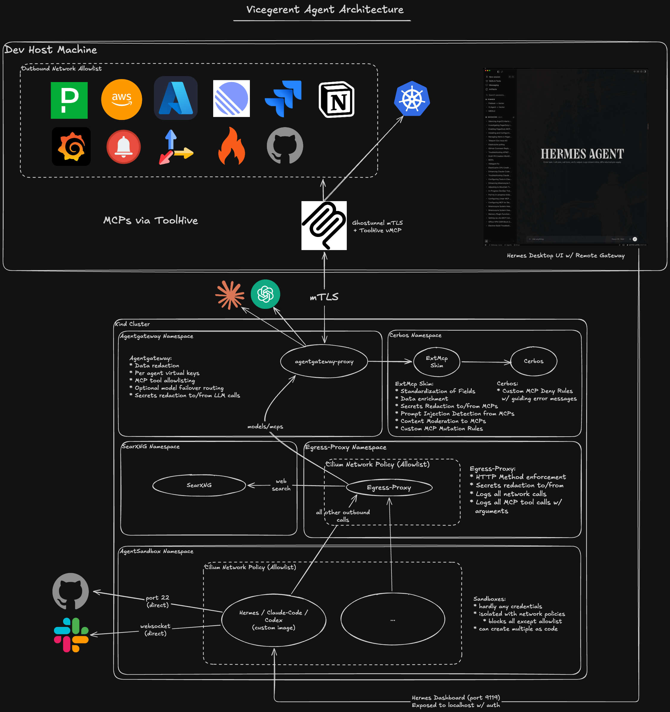

# Vicegerent Agents

GitOps repository for the **vicegerent** infra agent platform — credential-isolated, egress-locked Hermes agent sandboxes on a local Kind cluster (Cilium CNI), managed by Flux. It lets an agent run genuinely unattended (schedules, event triggers, no human approving every action) because containment is enforced by the platform, not by the agent's behavior — see [`docs/design.md`](docs/design.md) for the full rationale and how this compares to a laptop CLI agent or a plain container.



## Enforcement layers

Four independent layers sit between the agent and anything it can affect. Each is enforced by a different component, so no single compromise (a bad shell command, a malicious tool result, a prompt injection) clears the whole stack — the agent has to get past all of them.

| # | Layer | Enforces | Component | Docs |
|---|---|---|---|---|
| 1 | **Command approval** | Every shell command the agent runs, before it executes | `tools/approval.py` in the Hermes image, config from `approval-policy.yaml` | [AGENTS.md § Command Approval System](AGENTS.md#command-approval-system) |
| 2 | **Network egress** | Every outbound connection from the sandbox pod | Cilium (`CiliumNetworkPolicy`, kernel-level FQDN/IP allowlist) + the mitmproxy egress proxy (scrubbing, method/URL/SSRF checks) it fronts | [`charts/egress-proxy/README.md`](charts/egress-proxy/README.md) |
| 3 | **MCP tool selection** | Which tools exist for the agent to call at all | ToolHive vMCP `aggregation.tools` (`host/mcp/toolhive-servers.json`); agentgateway can also do this centrally | [`host/mcp/README.md`](host/mcp/README.md) |
| 4 | **MCP argument authorization** | What a selected tool is allowed to do with the arguments it was called with — deny, or mutate specific arguments before forwarding (e.g. keep a GitHub PR a draft, pin a Notion page's parent folder) | `mcp-cerbos-shim` + Cerbos, attached to agentgateway's `vmcp` backend (`FailClosed`) | [`images/mcp-cerbos-shim/README.md`](images/mcp-cerbos-shim/README.md) |

Layer 1 (command approval) runs a fixed pipeline in order — nothing later can override an earlier stage's block: **hardline block** (unconditional, catastrophic commands, hardcoded) → **silence list** (operator-configured patterns dropped before any LLM sees them — tirith findings and uncancellable patterns are never silenced) → **tirith** (static security scan) → **smart approval** (an auxiliary LLM judges what's left: auto-approve low-risk, auto-deny genuinely dangerous, escalate the rest to the user).

Layer 2 (network egress) is two things stacked, not one: Cilium enforces *which destinations exist at all* at the packet level (kernel-level — this is the layer a proxy bypass can't get around), and the mitmproxy egress proxy in front of the allowed HTTP(S) destinations enforces *what a request is allowed to look like* — GET/HEAD only, secrets scrubbed, no WebSocket upgrades, no SSRF into private ranges.

Layers 3 and 4 share one path: host vMCP → ghostunnel (mTLS) → agentgateway's `vmcp` backend → the agent. Selecting which tools exist is a config-only change in ToolHive with no cluster round-trip; authorizing a selected tool's arguments happens after that, in `mcp-cerbos-shim` + Cerbos. On allow, a mapped tool can also carry a mutation (a `force` block) — an unconditional argument rewrite applied only after Cerbos allows, e.g. a GitHub PR is rewritten to stay a draft, or a Notion page is rewritten to a fixed parent folder. It never overrides a deny. See [`AGENTS.md` § Repo Conventions](AGENTS.md#repo-conventions) ("MCP authorization layering") for the current list of denied resources and mutations.

## Repo layout

```text
apps/base/            shared platform layer: models, gateway routes, MCP backend, searxng
apps/<machine>/       per-machine overlay: pulls in apps/base plus that machine's own agents/ and egress-proxy (first machine: personal)
infrastructure/       the platform itself: Cilium, Flux, agentgateway, Cerbos, host-firewall, etc.
charts/               Helm charts backing apps/ and infrastructure/
host/mcp/             host-side MCP control plane (ToolHive + vMCP) — see docs/setup.md
images/               source-built container images (hermes, agentgateway-proxy, mcp-cerbos-shim)
scripts/              install, secrets, validation, and test scripts driven by ./vicegerent
clusters/personal/    Flux's per-machine entrypoint (kustomization + generated gotk-*.yaml); one dir per machine
docs/                 design rationale (docs/design.md) and full setup walkthrough (docs/setup.md)
```

`AGENTS.md` (symlinked as `CLAUDE.md`/`HERMES.md`) is the authoritative conventions doc for anyone — human or agent — changing this repo; read it before opening an MR.

## Extending this platform

Every extension point has a working example already in the repo to copy, not just a description:

- **A new agent or model route** — copy `apps/personal/agents/hermes` (within your machine's overlay) or `apps/base/models/anthropic` and adjust names/values; see [`AGENTS.md` § Repo Conventions](AGENTS.md#repo-conventions) ("the layout is the documentation").
- **A new machine** — one fork hosts a `clusters/<machine>/` + `apps/<machine>/` pair per machine; see [`docs/setup.md` § Adding a second machine](docs/setup.md).
- **A new MCP server** — add an entry to `host/mcp/toolhive-servers.json` alongside the 11 already there (kubernetes, github, gitlab, jira, grafana, notion, linear, etc.); see [`host/mcp/README.md`](host/mcp/README.md) for the workload shape, tool-scoping via `aggregation.tools`, and how secrets/OAuth are wired per server.
- **A new argument-authorization rule** — add a tool mapping to `infrastructure/controllers/mcp-cerbos-shim/mapping.yaml` (CEL expressions; `images/mcp-cerbos-shim/mapping.example.yaml` is a minimal worked example) and a matching Cerbos policy under `infrastructure/controllers/cerbos/policies/defs/`; the existing `resource_github.yaml`, `resource_gitlab.yaml`, `resource_linear.yaml`, etc. are working deny-by-resource examples; most carry a paired `*_test.yaml` you can copy for the new rule. See [`images/mcp-cerbos-shim/README.md`](images/mcp-cerbos-shim/README.md) for the CEL helper mechanism if the new resource needs one (e.g. normalizing a field name across spellings).
- **A mutation instead of a deny** — same mapping file, a `force` block on the tool entry (see the GitHub PR draft-forcing and Notion parent-folder-pinning entries already there for the pattern).

## Quickstart

Full walkthrough, flags, and troubleshooting: [`docs/setup.md`](docs/setup.md). Before your first bootstrap, see [`docs/setup.md` § Values to change for your fork](docs/setup.md#values-to-change-for-your-fork) — a handful of files ship with the original operator's own GitHub repos, Jira/Linear settings, git identity, and git host baked in as concrete values, not placeholders, so nothing fails loudly if you skip them. This is the condensed path on macOS with Docker:

```bash
# 1. Fork this repo and clone your fork (write access needed — Flux commits back to it)
git clone <your-fork-ssh-url> && cd vicegerent-agents

# 2. Create the Kind cluster + Cilium CNI
./vicegerent cluster setup

# 3. Provision secrets (platform-wide, then per agent)
export ANTHROPIC_API_KEY=***
./vicegerent secrets setup platform
./vicegerent secrets setup agent hermes

# 4. Bootstrap Flux against this repo
./vicegerent bootstrap

# 5. Bring up the host-side MCP control plane (ToolHive + vMCP)
./vicegerent mcp setup       # one-time: installs thv, ghostunnel, the Python venv
./vicegerent mcp configure
./vicegerent start

# 6. Open the agent's dashboard
./vicegerent agent dashboard hermes
```

Requires `kind`, `cilium-cli`, `kubectl`, `flux`, `helm`, `jq` on `PATH`, and an SSH key with write access to your fork.

## Development

```bash
pre-commit install
pre-commit run --all-files
```

The local Flux validation hook (`scripts/validate.sh`) expects `yq` v4, `kustomize`, `kubeconform`, `tar`, and `curl` on `PATH`.
