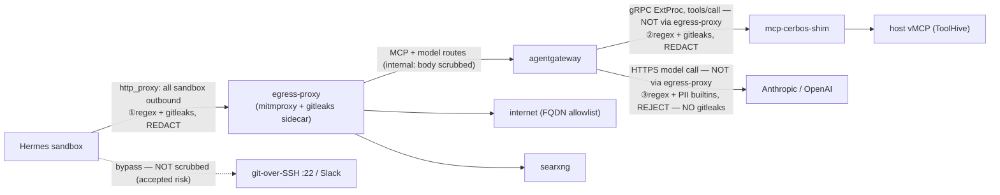

# Secret & PII redaction

Where credential-shaped strings and PII get scrubbed on this platform, in code and in
the network flow. This is the definitive reference for "does X leg redact, and against
what patterns."

> This doc describes the state once MR !426 (`feat/ai-backend-regex-scrubbing`,
> agentgateway AIPromptGuard) and MR !428 (`feat/pii-regex-egress-shim`, PII patterns on
> the egress-proxy and shim) both land. Neither is merged as this is written; file paths
> and pattern counts below match those two branches, not current `main`.

## Why three enforcement points

There is no single central scrubber because there is no single pipe to tap. Three
genuinely different processes make outbound calls that carry agent-controlled content,
and each call leaves from a different place:

- **The Hermes sandbox** makes its own HTTP(S) calls (curl, git-over-HTTP, MCP and model
  calls to agentgateway, searxng). Every one is forced through the egress-proxy by the
  `http_proxy`/`https_proxy` env vars set on the sandbox container
  (`charts/agent/templates/_sandbox.tpl`). That env var only binds the sandbox's own
  processes — it does nothing for any other pod.
- **agentgateway** makes a gRPC ExtProc call to `mcp-cerbos-shim` for every `tools/call`
  (the guardrail). This call originates from agentgateway, so it never touches the
  egress-proxy.
- **agentgateway** makes its own HTTPS call to the model provider (Anthropic/OpenAI).
  Also from agentgateway, also never through the egress-proxy.

The two agentgateway legs are provably disjoint from the sandbox's egress path: the
gateway's egress policy (`apps/base/gateway/egress-networkpolicy.yaml`) allows it to reach
the model providers directly (`toEntities: [world]` on 443) and the shim directly (cerbos
namespace, 4445), with no hop through the egress-proxy; and its ingress policy
(`apps/base/gateway/networkpolicy.yaml`) accepts the egress-proxy and the shim as two
*separate*, independently-allowed sources. A scrubber sitting on the sandbox's egress path
structurally cannot see either agentgateway-originated call, no matter how it is
configured — so each leg carries its own enforcement point.

## The three enforcement points

### 1. egress-proxy (mitmproxy, Python)

- **Covers:** all outbound HTTP(S) the Hermes sandbox itself makes — internet (FQDN
  allowlist), searxng, and the sandbox's own calls to agentgateway.
- **Catches:** the 16-pattern hand-rolled regex registry (`REDACT_PATTERNS` in
  `charts/egress-proxy/templates/addon-configmap.yaml`) **plus** gitleaks' ~180-rule
  default ruleset via the in-Pod localhost sidecar
  (`images/egress-gitleaks-sidecar`). Both layers run on every scrubbed string; a secret
  both recognize is counted once (each replaces its match with `<masked>` before the
  next layer sees the string).
- **Where the patterns live:** `REDACT_PATTERNS` in `addon-configmap.yaml`.
- **Action:** redact-and-forward. A matched secret/PII pattern is *never* a block — it is
  replaced with `<masked>` and the request/response proceeds. The proxy's 403s are for
  policy, not pattern matches: SSRF (private-address destination), non-GET/HEAD method to
  an external host, URL over 2048 chars, a body on a GET/HEAD, a WebSocket upgrade, or an
  FQDN not on the allowlist.
- **What is external-only:** SSRF block, URL-length limit, URL path/query scrub,
  GET/HEAD-body block, `Authorization`/`Basic`/`x-api-key` header scrub, method
  enforcement, and the FQDN allowlist all apply only to external destinations. Hosts
  ending in `.cluster.local`/`.svc` (agentgateway, searxng) are classified internal and
  skip those. **Body scrubbing and non-`Authorization` header scrubbing, however, run on
  internal traffic too** — so the sandbox→agentgateway leg is redacted here as well as at
  the shim. Only agentgateway's own legitimate auth header is deliberately left intact.
- **Known limits:** pattern-based only — no encoded-form detection (base64, hex, rot13),
  no Luhn check on card numbers, space/dash-grouped cards not matched. The FQDN allowlist
  is the primary external control, not this scrub. Streaming responses (SSE /
  `Transfer-Encoding: chunked`) are skipped to avoid buffering. git-over-SSH (port 22) and
  Slack bypass the proxy entirely and are not scrubbed (accepted risk, documented in
  `scrub.py`).

### 2. mcp-cerbos-shim (Go, agentgateway ExtProc guardrail)

- **Covers:** every MCP `tools/call` argument (`CheckRequest`, before the call reaches the
  host vMCP) and every tool result (`CheckResponse`, before the result reaches the model),
  regardless of which backend the tool lives on. This is the one place that sees every
  tool call in both directions.
- **Catches:** the same two layers as the egress-proxy — the hand-rolled
  `secretPatternRegistry` (`images/mcp-cerbos-shim/internal/server/secrets_redact.go`)
  **plus** gitleaks' ~180-rule ruleset, here run in-process (not a sidecar). Walks JSON
  recursively, including secrets one level of JSON-string-encoding deep (e.g. Jira's raw
  `additional_fields`).
- **Where the patterns live:** `secretPatternRegistry` in `secrets_redact.go`.
- **Action:** redact-and-forward (mutate, never deny). Redaction is just another argument
  rewrite, applied after Cerbos allows — the same `mutate()` path used for GitHub's
  forced-draft override. A matched pattern never turns into a Cerbos denial; the
  deny-by-resource guardrail (project/team/repo scoping) is a separate control.
- **Why it exists independently:** it is wired in by
  `apps/base/mcps/vmcp/policy.yaml` as a `remote.backendRef` guardrail processor on
  `tools/call` (`failureMode: FailClosed`). agentgateway's call to it is a direct gRPC hop
  (cerbos namespace, 4445) that never transits the egress-proxy — so it is the *only*
  scrubber on the leg carrying tool results back toward the model.
- **Known limits:** same pattern-only caveats as the egress-proxy (no encoded forms, no
  Luhn, grouped cards missed). If the gitleaks detector fails to build at startup it
  degrades to registry-only (weaker coverage, never down).

### 3. agentgateway AIPromptGuard (Rust regex, native CRD field)

- **Covers:** the model-facing request and response bodies on the three AI backends —
  `anthropic`, `openai`, `haiku-oai` (`apps/base/models/*/backend.yaml`). This is
  agentgateway's own HTTPS call to the provider, which never transits the egress-proxy.
- **Catches:** the 16 secret regexes hand-mirrored from `REDACT_PATTERNS`, plus PII via
  agentgateway's native `builtins: [Ssn, CreditCard, PhoneNumber]`. **No gitleaks layer** —
  AIPromptGuard is regex + webhook only, so the ~180-rule ruleset the other two legs carry
  has no equivalent here. This is the single most important coverage gap on the platform.
- **Where the patterns live:** the `promptGuard.request[].regex.matches` /
  `.response[].regex.matches` lists in each `backend.yaml`, hand-mirrored from
  `REDACT_PATTERNS` (see the maintenance note below).
- **Action:** `Reject` — unlike the other two legs, a match rejects the whole
  request/response rather than redacting it (response message: "Request rejected: outbound
  content matched a secret or PII guard pattern.").
- **Known limits / caveats:** regex-only, no gitleaks. The PII builtins are agentgateway's
  own implementations of SSN/card/phone detection, *not* the literal regexes the other two
  legs use, so their exact match behavior can differ. `streaming: Enabled` — on the
  **response** side the body has already begun streaming to the caller before the full
  content can be matched, so treat the response-side `Reject` as best-effort detection, not
  a hard guarantee. The request-side `Reject` is a real block.

## Flow

Every arrow that carries agent content is labelled with its enforcement point. The two
agentgateway-originated arrows (② and ③) are explicitly marked "NOT via egress-proxy" —
they are the disjoint legs egress-proxy cannot see. The ③ leg is the one gap to keep in
mind: regex-only, with **no gitleaks equivalent**. The dotted arrow (git-over-SSH, Slack)
bypasses all HTTP scrubbing by design.

## Pattern parity

All three legs carry the same 16 secret regexes and the same three PII categories. Only
the two gitleaks-backed legs carry the ~180-rule ruleset — the AI-provider leg does not.

| Pattern | egress-proxy | mcp-cerbos-shim | agentgateway promptGuard |
| --- | :---: | :---: | :---: |
| SSH private key | ✅ | ✅ | ✅ |
| Slack `xox*` token | ✅ | ✅ | ✅ |
| Slack `xapp-*` token | ✅ | ✅ | ✅ |
| `Bearer` value | ✅ | ✅ | ✅ |
| `Basic` value | ✅ | ✅ | ✅ |
| AWS access key ID | ✅ | ✅ | ✅ |
| GitHub token | ✅ | ✅ | ✅ |
| GitLab token | ✅ | ✅ | ✅ |
| Google API key | ✅ | ✅ | ✅ |
| OpenAI key | ✅ | ✅ | ✅ |
| Anthropic key | ✅ | ✅ | ✅ |
| Stripe key | ✅ | ✅ | ✅ |
| Notion token | ✅ | ✅ | ✅ |
| Twilio SID | ✅ | ✅ | ✅ |
| npm token | ✅ | ✅ | ✅ |
| Generic JWT | ✅ | ✅ | ✅ |
| US SSN | ✅ regex | ✅ regex | ✅ `Ssn` builtin |
| Credit card (Visa/MC/Amex/Discover) | ✅ 4 regexes | ✅ 4 regexes | ✅ `CreditCard` builtin |
| US phone | ✅ regex | ✅ regex | ✅ `PhoneNumber` builtin |
| Email | ❌ excluded | ❌ excluded | ❌ excluded |
| **gitleaks ~180-rule ruleset** | ✅ | ✅ | ❌ **none** |
| Action on match | redact | redact | **reject** |

The one asymmetry that matters: the bottom `gitleaks` row. On the AI-provider leg,
coverage is exactly the 16 secret regexes + 3 PII builtins in the table above and nothing
more — a provider token shaped only like one of gitleaks' other ~180 rules (and not like
one of the 16 regexes) reaches the model on that leg unscrubbed.

## The three-way hand-mirror

The 16-pattern secret set now lives in **three** hand-maintained copies with **no shared
source**:

1. `images/mcp-cerbos-shim/internal/server/secrets_redact.go` — `secretPatternRegistry`
   (Go, RE2).
2. `charts/egress-proxy/templates/addon-configmap.yaml` — `REDACT_PATTERNS` (Python, `re`).
3. `apps/base/models/{anthropic,openai,haiku-oai}/backend.yaml` — `promptGuard` `matches`
   (agentgateway, Rust regex crate).

They run in three different runtimes (Go, Python, Rust) with no natural place to share a
literal, so **adding or changing a secret pattern means editing all three by hand.** Miss
one and that leg silently loses coverage for that pattern. This is the biggest operational
risk in the whole redaction story — the patterns are kept RE2-compatible (no lookaround,
no backreferences) precisely so the same literal ports across all three dialects. The PII
row is only two-way (the Go/Python regexes vs. agentgateway's builtins), so PII changes
touch layers 1 and 2 by regex and layer 3 by builtin name.

## Why Email is excluded everywhere

None of the three legs match email addresses, deliberately. Email addresses are
load-bearing in legitimate agent traffic — most concretely, Jira ticket assignment is done
*by email address*, so scrubbing or rejecting on an email match would break a normal,
authorized workflow. agentgateway's PII builtins support an `Email` option and it was
deliberately dropped from all three backends (`builtins` is `[Ssn, CreditCard,
PhoneNumber]`, not `[Ssn, CreditCard, Email, PhoneNumber]`); the egress-proxy and shim
registries never had an email pattern for the same reason. Do not "helpfully" re-add it.
