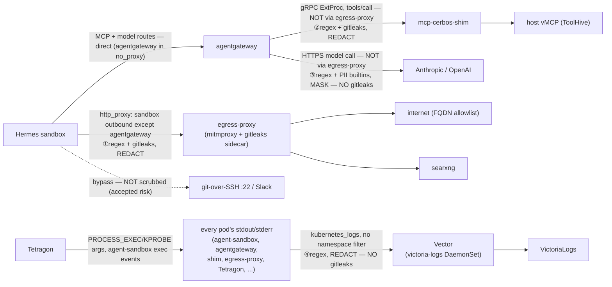

# Secret & PII redaction

Where credential-shaped strings and PII get scrubbed on this platform, in code and in
the network flow. This is the definitive reference for "does X leg redact, and against
what patterns."

## Why four enforcement points

There is no single central scrubber because there is no single pipe to tap. Three
genuinely different processes make outbound calls that carry agent-controlled content,
and each call leaves from a different place; a fourth point covers log ingestion, which
carries agent-controlled content by a completely different mechanism (stdout, not a
network call) and would otherwise bypass all three of the others entirely:

- **The Hermes sandbox** makes its own HTTP(S) calls (curl, git-over-HTTP, searxng). These
  are forced through the egress-proxy by the `http_proxy`/`https_proxy` env vars set on the
  sandbox container (`charts/agent/templates/_sandbox.tpl`). That env var only binds the
  sandbox's own processes — it does nothing for any other pod. **agentgateway is the
  exception:** it is in the sandbox's `no_proxy`, so the sandbox's MCP and model calls reach
  agentgateway *directly*, not through the egress-proxy — agentgateway carries its own
  scrubbing (legs 2 and 3 below), so the proxy hop was redundant for that destination.
- **agentgateway** makes a gRPC ExtProc call to `mcp-cerbos-shim` for every `tools/call`
  (the guardrail). This call originates from agentgateway, so it never touches the
  egress-proxy.
- **agentgateway** makes its own HTTPS call to the model provider (Anthropic/OpenAI).
  Also from agentgateway, also never through the egress-proxy.
- **Every pod** writes stdout/stderr, which Vector (the `victoria-logs` chart's log
  agent, a cluster-wide DaemonSet) scrapes unconditionally via a `kubernetes_logs`
  source with no namespace/pod filter. This is the one leg that isn't a network call at
  all — Tetragon's `PROCESS_EXEC`/`PROCESS_KPROBE` events (full command-line arguments
  for every process executed in `agent-sandbox`) land here via Tetragon's own stdout,
  and any component that logs a secret-shaped string at any log level lands here too.

The two agentgateway legs are provably disjoint from the sandbox's egress path: the
gateway's egress policy (`apps/base/gateway/egress-networkpolicy.yaml`) allows it to reach
the model providers directly (`toEntities: [world]` on 443) and the shim directly (cerbos
namespace, 4445), with no hop through the egress-proxy; and its ingress policy
(`apps/base/gateway/networkpolicy.yaml`) accepts the agent sandbox directly, plus the shim,
as *separate*, independently-allowed sources. A scrubber sitting on the sandbox's egress
path structurally cannot see either agentgateway-originated call, no matter how it is
configured — so each leg carries its own enforcement point. (The sandbox now also reaches
agentgateway directly rather than through the egress-proxy, so even the sandbox→agentgateway
request leg no longer transits the proxy — its scrubbing is leg 2/leg 3, not leg 1.)

## The four enforcement points

### 1. egress-proxy (mitmproxy, Python)

- **Covers:** the outbound HTTP(S) the Hermes sandbox itself makes to non-agentgateway
  destinations — internet (FQDN allowlist) and searxng. agentgateway is in the sandbox's
  `no_proxy` and is reached directly, so it no longer transits this proxy (see legs 2/3).
- **Catches:** the 16-pattern hand-rolled regex registry (`REDACT_PATTERNS` in
  `charts/egress-proxy/templates/addon-configmap.yaml`) **plus** gitleaks' ~180-rule
  default ruleset via the in-Pod localhost sidecar
  (`images/egress-gitleaks-sidecar`). Both layers run on every scrubbed string; a secret
  both recognize is counted once (each replaces its match with `<masked>` before the
  next layer sees the string).
- **Where the patterns live:** `REDACT_PATTERNS` in `addon-configmap.yaml`.
- **Action:** redact-and-forward. A matched secret/PII pattern is *never* a block — it is
  replaced with `<masked>` and the request/response proceeds. The proxy's 403s are for
  policy, not pattern matches: SSRF (private-address destination), non-GET/HEAD method to
  an external host, URL over 2048 chars, a body on a GET/HEAD, a WebSocket upgrade, or an
  FQDN not on the allowlist.
- **What is external-only:** SSRF block, URL-length limit, URL path/query scrub,
  GET/HEAD-body block, `Authorization`/`Basic`/`x-api-key` header scrub, method
  enforcement, and the FQDN allowlist all apply only to external destinations. Hosts
  ending in `.cluster.local`/`.svc` (searxng) are classified internal and skip those.
  **Body scrubbing and non-`Authorization` header scrubbing, however, run on internal
  traffic too** — so the sandbox→searxng leg is redacted here. (agentgateway is no longer
  reached through this proxy at all, so its request leg is scrubbed at leg 2/leg 3, not here.)
- **Known limits:** pattern-based only — no encoded-form detection (base64, hex, rot13),
  no Luhn check on card numbers, space/dash-grouped cards not matched. The FQDN allowlist
  is the primary external control, not this scrub. Streaming responses (SSE /
  `Transfer-Encoding: chunked`) are skipped to avoid buffering. git-over-SSH (port 22) and
  Slack bypass the proxy entirely and are not scrubbed (accepted risk, documented in
  `scrub.py`).

### 2. mcp-cerbos-shim (Go, agentgateway ExtProc guardrail)

- **Covers:** every MCP `tools/call` argument (`CheckRequest`, before the call reaches the
  host vMCP) and every tool result (`CheckResponse`, before the result reaches the model),
  regardless of which backend the tool lives on. This is the one place that sees every
  tool call in both directions. `resources/read` and `prompts/get` results are also
  covered on the response leg only (HAH-101) -- neither method has a Cerbos mapping
  to build an authorizable resource from, so only their response bodies pass through
  redaction; there is no request-side check for either.
- **Catches:** the same two layers as the egress-proxy — the hand-rolled
  `secretPatternRegistry` (`images/mcp-cerbos-shim/internal/server/secrets_redact.go`)
  **plus** gitleaks' ~180-rule ruleset, here run in-process (not a sidecar). Walks JSON
  recursively, including secrets one level of JSON-string-encoding deep (e.g. Jira's raw
  `additional_fields`).
- **Where the patterns live:** `secretPatternRegistry` in `secrets_redact.go`.
- **Action:** redact-and-forward (mutate, never deny). Redaction is just another argument
  rewrite, applied after Cerbos allows — the same `mutate()` path used for GitHub's
  forced-draft override. A matched pattern never turns into a Cerbos denial; the
  deny-by-resource guardrail (project/team/repo scoping) is a separate control.
- **Why it exists independently:** it is wired in by
  `apps/base/mcps/vmcp/policy.yaml` as a `remote.backendRef` guardrail processor on
  `tools/call` (`failureMode: FailClosed`). agentgateway's call to it is a direct gRPC hop
  (cerbos namespace, 4445) that never transits the egress-proxy — so it is the *only*
  scrubber on the leg carrying tool results back toward the model.
- **Known limits:** same pattern-only caveats as the egress-proxy (no encoded forms, no
  Luhn, grouped cards missed). If the gitleaks detector fails to build at startup it
  degrades to registry-only (weaker coverage, never down).

### 3. agentgateway AIPromptGuard (Rust regex, native CRD field)

- **Covers:** the model-facing request and response bodies on the three AI backends —
  `anthropic`, `openai`, `haiku-oai` (`apps/base/models/*/backend.yaml`). This is
  agentgateway's own HTTPS call to the provider, which never transits the egress-proxy.
- **Catches:** the 16 secret regexes hand-mirrored from `REDACT_PATTERNS`, plus PII via
  agentgateway's native `builtins: [Ssn, CreditCard, PhoneNumber]`. **No gitleaks layer** —
  AIPromptGuard is regex + webhook only, so the ~180-rule ruleset the other two legs carry
  has no equivalent here. This is the single most important coverage gap on the platform.
- **Where the patterns live:** the `promptGuard.request[].regex.matches` /
  `.response[].regex.matches` lists in the shared kustomize component
  `apps/base/models/_components/promptguard-secrets/patch.yaml` (applied to all three
  backends), hand-mirrored from `REDACT_PATTERNS` (see the maintenance note below).
- **Action:** `Mask` — redact-and-forward, like the other legs: a matched span is replaced
  with `<masked>` and the request/response continues rather than blocking the call. (This
  was `Reject` until the agentgateway-direct-egress change; it was switched to `Mask` so the
  behavior mirrors the egress-proxy and shim now that this leg also carries the
  sandbox→agentgateway request that the proxy used to scrub.)
- **Known limits / caveats:** regex-only, no gitleaks. The PII builtins are agentgateway's
  own implementations of SSN/card/phone detection, *not* the literal regexes the other two
  legs use, so their exact match behavior can differ. `streaming: Enabled` — on the
  **response** side the body has already begun streaming to the caller before the full
  content can be matched, so treat response-side masking as best-effort detection, not a
  hard guarantee. Request-side masking runs on the full body before forwarding, so it is
  reliable.

### 4. victoria-logs Vector agent (VRL remap, cluster-wide DaemonSet)

- **Covers:** every pod's stdout/stderr cluster-wide, ingested by Vector's
  `kubernetes_logs` source with no namespace/pod filter
  (`infrastructure/controllers/victoria-logs/chart/values.yaml`). This is not a network
  call the other three legs could ever see — it's log scraping, a structurally different
  mechanism. Notably this is what carries Tetragon's `PROCESS_EXEC`/`PROCESS_KPROBE`
  events (full command-line arguments for every process executed in `agent-sandbox`) into
  VictoriaLogs, since Tetragon's own stdout is one of the pods Vector scrapes.
- **Catches:** the same 20 secret + PII regexes as the other legs (`redactor` transform in
  `values.yaml`), ported to VRL/Rust-regex-crate syntax. Runs after the `parser` transform
  that flattens Tetragon's JSON event shape into `.message`, so exec arguments are
  redacted before the sink ships them. **No gitleaks layer** — there is no sidecar in this
  pod, same gap as the AI-provider leg above.
- **Where the patterns live:** the `redactor` transform's `source:` block in
  `infrastructure/controllers/victoria-logs/chart/values.yaml`, hand-mirrored from
  `REDACT_PATTERNS`.
- **Action:** redact-and-forward, like egress-proxy and the shim — a match replaces the
  substring with `<masked>` in `.message` and the (now-redacted) log line still ships to
  VictoriaLogs. There is no reject/drop path for logs; the point is to scrub before
  retention, not to block observability.
- **Known limits:** regex-only, no gitleaks, no encoded-form detection — same caveats as
  the other regex legs. Only `.message` is redacted; other structured fields Vector
  attaches (`kubernetes.*` labels, `log.*` sub-fields left over from the JSON parse) are
  not scanned, so a secret that lands in a *label* rather than the message body would
  still slip through. VictoriaLogs retains 7 days (`server.retentionPeriod`) — anything
  this leg misses persists in queryable form for that window.

## Flow

Every arrow that carries agent content is labelled with its enforcement point. The two
agentgateway-originated arrows (② and ③) are explicitly marked "NOT via egress-proxy" —
they are the disjoint legs egress-proxy cannot see. The sandbox→agentgateway arrow is now
also direct (agentgateway is in the sandbox `no_proxy`), so the MCP/model request leg is
scrubbed at ②/③ rather than ①. The ③ leg is one gap to keep in mind: regex-only, with
**no gitleaks equivalent** — the ④ leg shares that same gap. The dotted
arrow (git-over-SSH, Slack) bypasses all HTTP scrubbing by design; note this bypass is
scoped to the HTTP legs only — a secret in a git-over-SSH or Slack-bound command's
arguments is still exec'd inside the sandbox and so still passes through Tetragon → ④,
even though the network call itself never touches egress-proxy.

## Pattern parity

All four legs carry the same 16 secret regexes and the same three PII categories. Only
the two gitleaks-backed legs carry the ~180-rule ruleset — the AI-provider leg and the
Vector log leg do not.

| Pattern | egress-proxy | mcp-cerbos-shim | agentgateway promptGuard | victoria-logs Vector |
| --- | :---: | :---: | :---: | :---: |
| SSH private key | ✅ | ✅ | ✅ | ✅ |
| Slack `xox*` token | ✅ | ✅ | ✅ | ✅ |
| Slack `xapp-*` token | ✅ | ✅ | ✅ | ✅ |
| `Bearer` value | ✅ | ✅ | ✅ | ✅ |
| `Basic` value | ✅ | ✅ | ✅ | ✅ |
| AWS access key ID | ✅ | ✅ | ✅ | ✅ |
| GitHub token | ✅ | ✅ | ✅ | ✅ |
| GitLab token | ✅ | ✅ | ✅ | ✅ |
| Google API key | ✅ | ✅ | ✅ | ✅ |
| OpenAI key | ✅ | ✅ | ✅ | ✅ |
| Anthropic key | ✅ | ✅ | ✅ | ✅ |
| Stripe key | ✅ | ✅ | ✅ | ✅ |
| Notion token | ✅ | ✅ | ✅ | ✅ |
| Twilio SID | ✅ | ✅ | ✅ | ✅ |
| npm token | ✅ | ✅ | ✅ | ✅ |
| Generic JWT | ✅ | ✅ | ✅ | ✅ |
| US SSN | ✅ regex | ✅ regex | ✅ `Ssn` builtin | ✅ regex |
| Credit card (Visa/MC/Amex/Discover) | ✅ 4 regexes | ✅ 4 regexes | ✅ `CreditCard` builtin | ✅ 4 regexes |
| US phone | ✅ regex | ✅ regex | ✅ `PhoneNumber` builtin | ✅ regex |
| Email | ❌ excluded | ❌ excluded | ❌ excluded | ❌ excluded |
| **gitleaks ~180-rule ruleset** | ✅ | ✅ | ❌ **none** | ❌ **none** |
| Action on match | redact | redact | redact (mask) | redact |

Two asymmetries matter: the bottom `gitleaks` row, and the Vector leg's structurally
narrower field coverage. On the AI-provider leg, coverage is exactly the 16 secret
regexes + 3 PII builtins in the table above and nothing more — a provider token shaped
only like one of gitleaks' other ~180 rules (and not like one of the 16 regexes) reaches
the model on that leg unscrubbed. On the Vector leg, only the `.message` field is
scrubbed — a secret landing in a structured field Vector attaches separately
(`kubernetes.*` labels, etc.) would not be caught even though the same 16+3 patterns run
against the log body.

## The four-way hand-mirror

The 16-pattern secret set now lives in **four** hand-maintained copies with **no shared
source**:

1. `images/mcp-cerbos-shim/internal/server/secrets_redact.go` — `secretPatternRegistry`
   (Go, RE2).
2. `charts/egress-proxy/templates/addon-configmap.yaml` — `REDACT_PATTERNS` (Python, `re`).
3. `apps/base/models/_components/promptguard-secrets/patch.yaml` — the shared `promptGuard`
   `matches` component applied to all three AI backends (agentgateway, Rust regex crate).
4. `infrastructure/controllers/victoria-logs/chart/values.yaml` — the `redactor`
   transform's `source:` block (VRL, Rust regex crate under the hood — same dialect as
   #3, but a separate literal copy since VRL and agentgateway's CRD field have no shared
   config surface).

They run in three different regex dialects across four separately-maintained files with
no natural place to share a literal, so **adding or changing a secret pattern means
editing all four by hand.** Miss one and that leg silently loses coverage for that
pattern. This is the biggest operational risk in the whole redaction story — the patterns
are kept RE2-compatible (no lookaround, no backreferences) precisely so the same literal
ports across all three regex dialects (Go RE2, Python `re`, Rust regex crate used by both
#3 and #4). The PII row is only two-way in terms of *representation* (the
Go/Python/VRL regexes vs. agentgateway's native builtins), so PII changes touch layers 1,
2, and 4 by regex and layer 3 by builtin name.

## Why Email is excluded everywhere

None of the four legs match email addresses, deliberately. Email addresses are
load-bearing in legitimate agent traffic — most concretely, Jira ticket assignment is done
*by email address*, so masking or rejecting on an email match would break a normal,
authorized workflow. agentgateway's PII builtins support an `Email` option and it was
deliberately dropped from all three backends (`builtins` is `[Ssn, CreditCard,
PhoneNumber]`, not `[Ssn, CreditCard, Email, PhoneNumber]`); the egress-proxy and shim
registries never had an email pattern for the same reason. Do not "helpfully" re-add it.
